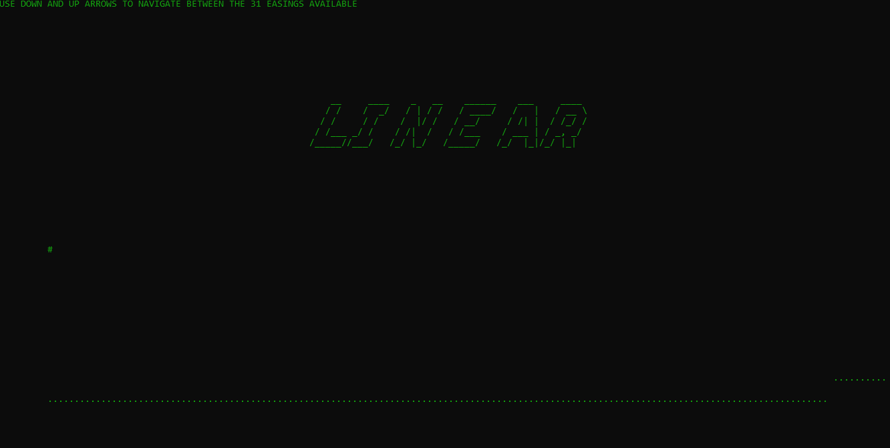

Doog
===========

[](https://ci.appveyor.com/project/giacomelli/doog)
[](https://sonarcloud.io/dashboard?id=Doog)
[](https://sonarcloud.io/dashboard?id= Doog)
[](https://raw.githubusercontent.com/giacomelli/Doog/master/LICENSE)

Doog is a framework to create console/terminal games, but using advanced game programming patterns.



--------

## Feature
* Animations (30+ easings)
* Font System
* Graphic system (console/terminal)
* Input system
* Log system (console and file)
* Physic system (currently supporing just collision detection)
* Transform (position, scale and rotation)

## Games
Nowadays we have just a Snake game implementation that show how to use Doog to create a old style game. 

### Snake


## Boundaries
* Graphic agnostic
* Sound agnostic
* Input agnostic
* Use of classic game programming patterns (http://gameprogrammingpatterns.com)
* Follow the SOLID principles

## How to run it?

### Build
Open a console/terminal and type:
```shell
git clone https://github.com/giacomelli/Doog.git
cd Doog/src
dotnet build
```
## Run Snake game

```shell
dotnet run --project Samples/Snake
```

### Run Doog.samples

```shell
dotnet run --project Samples/Doog.Samples
```

## How to debug it?
If you are developing a game using Doog and want some help to debug it, you can use the runners arguments below:

### debug-enabled
Shows some stats about the game world in the left-top corner of the game screen. Informations like FPS and currenlty enabled components count.

```shell
dotnet run --project Samples/Snake debug-enabled
```

### ingame-log
Show the log messages registered by the LogSystem in the bottom part of the game screen.

```shell
dotnet run --project Samples/Snake ingame-log
```

### file-log
Write the log messages registered by the LogSystem to the log.txt file.

```shell
dotnet run --project Samples/Snake file-log
```

### You can combine those arguments:

```shell
dotnet run --project Samples/Snake debug-enabled ingame-log
```

## How to improve it?

* Create a fork of [Doog](https://github.com/giacomelli/Doog/fork). 
* Did you change it? [Submit a pull request](https://github.com/giacomelli/Doog/pull/new/master).

## License
Licensed under the The MIT License (MIT).
In others words, you can use this library for developement any kind of software: open source, commercial and proprietary.
